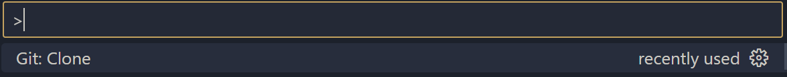

# **Jeu de la vie**

## Contexte :

Le jeu de la vie est un automate cellulaire proposé par le mathématicien John Conway. Il permet de suivre l’évolution d’une population de cellules au cours du temps. Ces cellules sont dans une grille en deux dimensions et chaque cellule peut avoir deux états, soit vivante, soit morte.  
Le temps va être appelé itération et chaque cellule change d’état selon ce temps.

Pour cela deux règles définissent le jeu de la vie :

- Une cellule morte possédant exactement trois voisines devient vivante.

- Une cellule vivante possédant deux ou trois voisines vivantes reste vivante, sinon elle meurt.

## Sommaire :

## Documentation Utilisateur :

### Implémenter le programme :

Pour impléter le programme, il faut le télécharger ou le cloner.

#### Télécharger le programme :

Maintenant, il faut déziper le dossier et ajouter manuellement les fichiers dans le dossier que vous souhaité.

Vous avez maintenant accès au programme.

#### Cloner le programme sur VSCODE:

- Connectez vous à GITHUB sur VSCODE.

- Copié collé ce lien :

- Faite CTRL SHIFT P sur VSCODE et séléctioner "GIT : CLONE".

- Séléctionner "Clone From GITHUB".

- Coller le lien :

- Puis choissisez le répertoire où vous souhaité cloner le programme.

#### Ajoutez / Modifier un fichier d'entrée :

## Documentation Technique :
